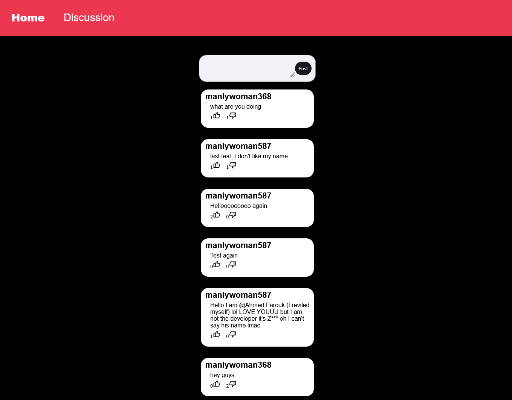

# Hackchan

a place for Hackclubbers to express thier opinions freely

## Features

### Total incognito

nobody knows you

your username is based on your ip adress and is generated randomly

### Random username generation

your ip is converted into a seed using an algorithm called the LGC formula then is used as a random number generator to decide the username based on 3 parts

- the adjective -> it is a random one from this list ["strong","manly","beutiful","kind","baby","hyper","super"]
- the name -> it is a random one from this list ["man","woman","cucumber","baby","watermelon","zebra","giraffe","integer"]
- the number -> it is a random number from 0 to 1000

so your username could be babybaby826 or even superzebra1

### Posting

you can post unlimited posts per day

NO LIMITS ON THAT

### voting system

you can also upvote or downvote any post

MORE UPVOTES MEANS MORE TRUST

### Home page

When opening the home page you will have to discover the text by yourself using the flashlight to be able to enter the Secret discussions room where you can actually post (SHHHHH!)

## Tech used

the front end is made using html,css and javascript while the backend is made using python fastapi deployed using railway and also used the ipinfo api to get the ip of the device

## API

this website uses 2 apis 

ipapi.co/json

to get the ip and the backend api

the backend api is made using python fastapi and stores the data using sqlite3

these are the endpoints

### get_posts

use this end point to get all posts that have been shared

https://hackchan3-production.up.railway.app/get_posts/

it is in an array that contains JSONs with all posts

### add_post

use this end point with a POST request with these parameters to add a new post

- ip -> this is your device ip
- message -> the message of the post

https://hackchan3-production.up.railway.app/add_post/

### togggle_upvote

use this end point to upvote a post with these parameters

- ip -> the ip of the device
- id -> id of the post you want to upvote

https://hackchan3-production.up.railway.app/toggle_upvote/

### togggle_downvote

use this end point to upvote a post with these parameters

- ip -> the ip of the device
- id -> id of the post you want to downvote

https://hackchan3-production.up.railway.app/toggle_downvote/

## How to Clone

just use this simple command

`git clone https://github.com/zezo386/HackChan`

## Author

this code is made by Ziad Elhusiny The GOAT of programming
